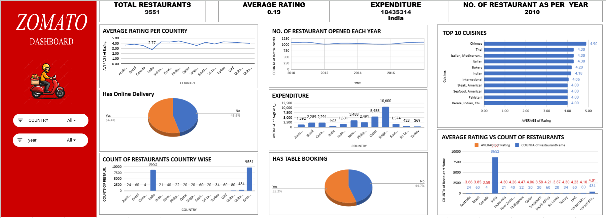

# Spreadsheet- Zomato Restaurants Expansion
This project focuses on analyzing a restaurant dataset using Microsoft Excel.  The objective was to clean the raw data, perform data analysis using Pivot Tables,  and build an interactive dashboard to visualize business insights.  The dashboard provides a clear overview of sales performance ,  customer behavior, and revenue distribution.
## 🖼 Dashboard Preview

⚠️ Note: Excel, PowerPoint, and Word files cannot be previewed directly on GitHub.  
Please download the files to view the complete dashboard and documentation.
## 🛠 Tools Used
- Microsoft Excel
- Pivot Tables
- Data Cleaning
- KPI Analysis
- 2D Charts

## 📊 Key Insights
- Country-wise restaurant distribution
- Top 10 cuisines analysis
- Average rating comparison
- Online delivery vs table booking analysis
- Expansion opportunity identification

## 🚀 Skills Demonstrated
✔ Data Cleaning  
✔ Data Visualization  
✔ Dashboard Design  
✔ Business Analysis  
✔ Insight Extraction

## 📂 Project Files Included

- 📈 **Project Presentation** – Project Presentation.pptx  
- 📝 **Detailed Project Report** – Project Report.docx  
- 🖼 **Dashboard Preview Image** – Dashboard.png
